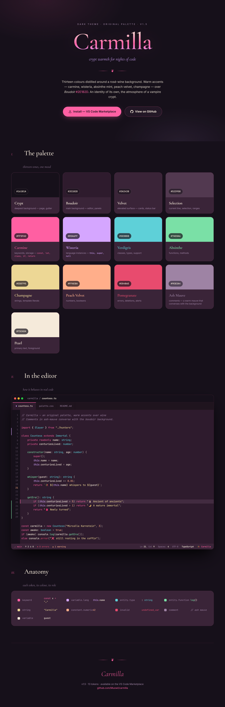

<h1 align="center">🥀 Carmilla</h1>

<p align="center"><em>Crypt warmth for nights of code.</em></p>

<p align="center">
  An original dark theme with a <strong>boudoir/wine</strong> identity — a rosé-wine background and warm accents:
  carmine, wisteria, absinthe mint, peach velvet and champagne.
</p>

<p align="center">
  <a href="https://muowl.dev/"><strong>🔗 See the live showcase</strong></a>
</p>

<p align="center">
  <a href="https://marketplace.visualstudio.com/items?itemName=muowl.carmilla"></a>
  <a href="LICENSE"></a>
</p>

---

> The name *Carmilla* is a tribute to Sheridan Le Fanu's gothic novella (1872), a classic of vampire literature.

## Why it exists

Most dark themes lean to the cold side of the spectrum (icy blues and purples). Carmilla does the opposite:
**thermal coherence** — everything leans warm. The detail that defines its identity is the comments in
**Ash Mauve**, which converse with the background instead of clashing with it.

## Preview

<p align="center">
  
</p>

See it [live](https://muowl.dev/) or open [`index.html`](index.html) locally in your browser.

## Palette

| Token          | Hex        | Use                                              |
|----------------|------------|--------------------------------------------------|
| Crypt          | `#16101A`  | Deepest background — page, gutter                |
| Boudoir        | `#2E1B2D`  | Main background — editor, panels                 |
| Velvet         | `#3A2438`  | Elevated surface — cards, status bar             |
| Selection      | `#523950`  | Current line, selection, ranges                  |
| Pearl          | `#F5EADA`  | Primary text / foreground                        |
| Carmine        | `#FF5FA2`  | Keywords, storage (`const`, `class`, `return`)   |
| Wisteria       | `#D5A6FF`  | Language instances (`this`, `super`, `null`)     |
| Verdigris      | `#5ED0D8`  | Classes, types, support                          |
| Absinthe       | `#7AE0A6`  | Functions, methods                               |
| Champagne      | `#EDD795`  | Strings, template literals                       |
| Peach Velvet   | `#FFAE8A`  | Numbers, booleans                                |
| Pomegranate    | `#E84B6E`  | Errors, deletions, alerts                        |
| Ash Mauve      | `#9E83A4`  | Comments, disabled code                          |

Full specification, design rationale and TextMate mapping in [`PALETTE.md`](PALETTE.md).

## Flavors

Carmilla ships in **flavors** — variants that swap only the signature accent while the
boudoir/wine atmosphere stays put (backgrounds, Pearl text and Ash Mauve comments never change).

| Flavor                | Accent                              |
|-----------------------|-------------------------------------|
| **Carmilla**          | Carmine `#FF5FA2` — rosé            |
| **Carmilla Cinnabar** | Cinnabar `#F47C30` — ember-orange  |

Pick either under **Color Theme** (`Ctrl+K Ctrl+T`). See [`PALETTE.md`](PALETTE.md) for the rationale.

## Installation

### From the Marketplace

Open the Extensions view in VS Code (`Ctrl+Shift+X`), search for **Carmilla**, and click **Install** — or run:

```sh
code --install-extension muowl.carmilla
```

Then activate it under **Color Theme** (`Ctrl+K Ctrl+T`) → **Carmilla** (or **Carmilla Cinnabar**).

### From a `.vsix` file

1. Build the package: `npm run package` (uses [`@vscode/vsce`](https://github.com/microsoft/vscode-vsce) via `npx`, producing `carmilla-1.2.0.vsix`).
2. In VS Code: command palette (`Ctrl+Shift+P`) → **Extensions: Install from VSIX...** → pick the generated `.vsix`.
3. Activate it under **Color Theme** (`Ctrl+K Ctrl+T`) → **Carmilla** (or **Carmilla Cinnabar**).

### For development

Open this folder in VS Code and press `F5` to launch an *Extension Development Host* window with the theme already loaded.

## Files

| File             | Role                                                             |
|------------------|------------------------------------------------------------------|
| `PALETTE.md`     | Source of truth — portable spec and rationale                    |
| `carmilla.json`  | VS Code theme (UI + syntax + ANSI terminal + git)                |
| `carmilla-cinnabar.json` | Cinnabar flavor — base palette with an ember-orange accent |
| `package.json`   | Extension manifest (`contributes.themes`)                        |
| `index.html`     | Visual showcase                                                  |

## License

[MIT](LICENSE). Every colour is original to this palette — no third-party attribution required.
